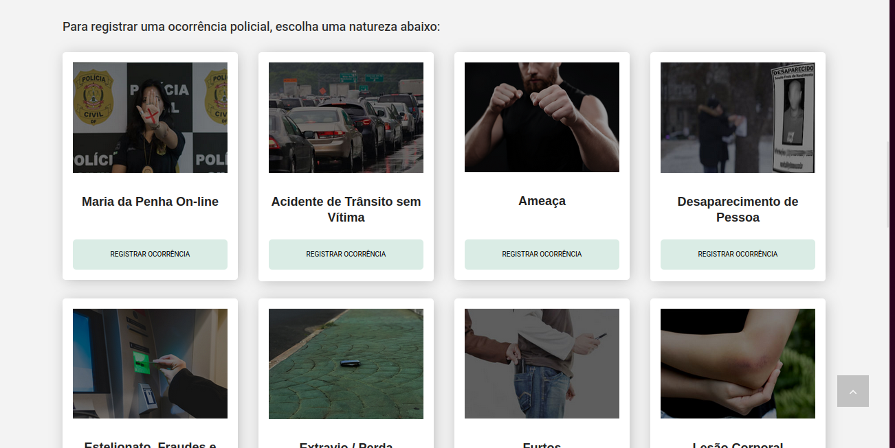

# GOMS (Goals, Operators, Methods, And Selection Rules)

## Introdução 
O GOMS é um método para descrever uma tarefa e o conhecimento do usuário sobre
como realizá-la em termos de objetivos (goals), operadores (operators), métodos (methods)
e regras de seleção (selection rules).

 * Os objetivos representam o que o usuário quer realizar utilizando o software
 * Operadores: são as ações cognitivas ou físicas que o sistema permite que o usuário execute, como inserir dados via teclado
 * Os métodos são sequências bem conhecidas de subobjetivos e operadores que permitem atingir um objetivo maior.
 * Regras de exeção: Referem-se a tomada de decisão por parte do usuário diante da possibilidade de possuir mais de um
 método para utilizar

## GOMS-KLM
 O KLM é a técnica mais simples de GOMS, limitada a um conjunto predefinido de operadores primitivos descrito na tabela 1

Tabela 1 

## Funcionalidades Avaliadas pela GOMS
     Tabela que monstra quais funcionalidades foram avaliadas pela HTA
 Funcionalidade    |    Integrante Responsável             |  
|:------:|:-------------------------------:|
| Registro de Ocorrência   | Rayene        |
| 197- Denúncia Online   | Giovana          |  

# Registro de Ocorrência

## Modelo Goals, Operators, Methods, and Selection rules (GOMS)

[Rayene Almeida](https://github.com/rayenealmeida) aplicará o modelo GOMS para analisar detalhadamente as ações cognitivas e motoras dos usuários ao realizar o registro de ocorrências no site da PCDF. A integrante identificará os objetivos que os usuários buscam alcançar ao usar essa funcionalidade, os operadores cognitivos e motores necessários para realizar as tarefas, os métodos sequenciais utilizados para atingir esses objetivos e as regras de seleção que orientam o comportamento do usuário diante de diferentes opções disponíveis na interface.

## Meta: Registrar uma ocorrência no site da PCDF

### Passos GOMS:

#### Objetivo (Goal):
- Identificar a necessidade de registrar uma ocorrência e decidir usar o site da PCDF para fazer isso.

#### Operadores (Operators):
- **Cognitivos:**
  - Selecionar a Opção de Registrar Ocorrência.
  - Ler e compreender as instruções fornecidas na página de registro de ocorrência.
  - Identificar os campos obrigatórios no formulário de registro.
  - Decidir quais informações são relevantes e devem ser fornecidas.

 Figura 1 - Página inicial do Registro de Ocorrência. Fonte: Site PCDF  
 

 Figura 2 - Seleção de Natureza para a Ocorrência. Fonte: Site PCDF  
 

- **Motoras:**
  - Mover o cursor para clicar nos campos de entrada do formulário.
  - Digitar as informações necessárias nos campos do formulário.
  - Clicar no botão de envio para submeter o formulário.

 Figura 3 - Formulário da Ocorrência. Fonte: Site PCDF  
 

#### Métodos (Methods):
- **Passos Sequenciais:**
  1. Acessar a seção de "Registro de Ocorrência" no site da PCDF.
  2. Ler as instruções e requisitos fornecidos.
  3. Preencher os campos obrigatórios do formulário (como dados pessoais, descrição da ocorrência, etc.).
  4. Revisar as informações inseridas para garantir que estejam corretas e completas.
  5. Clicar no botão "Enviar" para submeter a ocorrência.
- **Ações de Correção:**
  - Corrigir erros de digitação nos campos do formulário.
  - Revisar e editar as informações inseridas, se necessário, antes de enviar.

#### Regras de Seleção (Selection rules):
- Decidir quais informações incluir no relato da ocorrência com base nas instruções fornecidas e na relevância para o caso.
- Escolher entre digitar manualmente as informações ou usar recursos como copiar e colar, se aplicável e disponível.

# 197- Denúncia Online
Nessa tarefa o usuário pretende fazer uma denúncia no site da PCDF, foi analisada pela integrante  [Giovana Barbosa](https://github.com/gio221), como monstrado na figura 1. Ultilizando a CMN-GOMS

* GOAL 0: Fazer Denúncia
    * GOAL 1: Denúncia Online
        * OP 1.1: Guiar o mouse para a aba de denuncia online
        * 0P 1.2: Pressionar o botão
    * GOAL 2: Selecionar a opção denuncia por meios de comunicação
        * OP 2.1: Guiar o mouse para a opção 'Denuncia de meios de comunicação'
        * OP 2.2: Pressionar o botão
    * GOAL 3: Fazer Denuncia
        * OP 3.1: Colocar as informações
        * OP 3.2: Clicar no botão denunciar 

## Bibliografia
> BARBOSA, S.D.J.; SILVA, B.S. Interação Humano-Computador. Editora Campus-Elsevier, 2010.

## Referências bibliograficas

>Polícia Civil do Distrito Federal. Delegacia Eletrônica. Capturado em 18 de abril de 2024, de https://www.pcdf.df.gov.br/servicos/delegacia-eletronica.

## Histórico de Versões

| Versão |          Descrição              |     Autor(es)      |      Data      |   Revisor(es)     |    Data de revisão    |  
|:------:|:-------------------------------:|:--------------:|:--------------:|:-------------:|:---------------------:|
|  1.0   | Criação do documento de hta                  |  [Giovana Barbosa](https://github.com/gio221)      |   18/04   |        |             |
|  1.1   | Registro de Ocorrência                    |   [Rayene Almeida](https://github.com/rayenealmeida)      |   18/04   |               |                    |
|  1.2   | 197               |   [Giovana Barbosa](https://github.com/gio221)        |   18/04   |       |                |