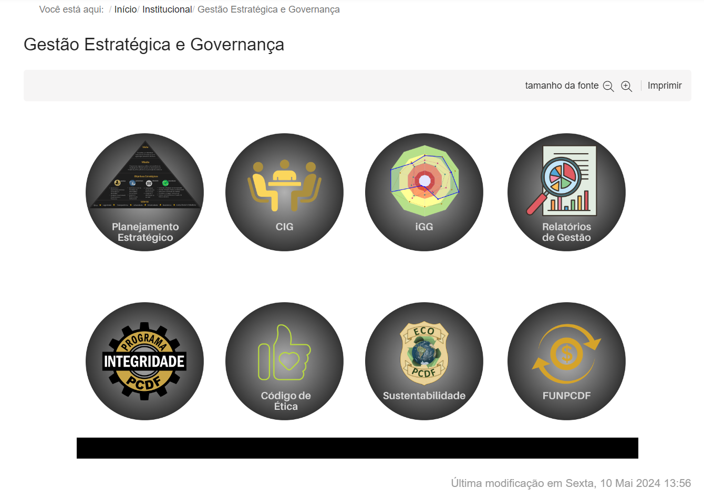

# Introdução 

As metas de usabilidade são objetivos específicos estabelecidos no design e na avaliação de sistemas interativos, com o propósito de melhorar a experiência do usuário e a eficácia das interações. Essas metas tendem garantir que o sistema seja intuitivo, eficiente e agradável de se usar, que seja acessível, com fácil navegação, clareza na apresentação de informações e eficiência na realização de tarefas.

# Metodologia 

Metas de usabilidade é o processo estruturado utilizado para estabelecer, implementar e avaliar objetivos específicos relacionados à experiência do usuário em sistemas interativos. Envolve a definição clara de metas, a escolha de métodos apropriados para coletar dados e medir o desempenho em relação a essas metas, bem como a análise dos resultados para informar ajustes no design e na funcionalidade do sistema. Essa abordagem preza garantir que os produtos e serviços digitais sejam desenvolvidos com base nas necessidades dos usuários, resultando em interfaces mais eficazes, intuitivas e satisfatórias.

## 1. Eficácia e Eficiência
A eficácia refere-se à habilidade dos usuários de interagir com o sistema de forma a alcançar seus objetivos de maneira precisa e conforme o esperado. Eficiêcia geralmente envolve aspectos como tempo necessário, esforço humano e materias utilizados 

### No sistema
O site se mostra eficaz em alguns aspectos, como em sua proposta de dispor informações no endereço eletrônico. Por outro lado, mostra-se ineficiente pois os serviços ofertados não necessariamente funcionam como deveria. Por exemplo, as informações sobre a obtenção da primeira segunda via da carteira de identidade estão bem dispostas, mas o agendamento para tal procedimento pode falhar em determinados momentos.

## 2. Facilidade de aprendizado
Facilidade de aprendizagem diz respeito à quantidade de tempo e esforço necessários para que os usuários adquiram habilidades e competências suficientes para utilizar o sistema com eficácia e desempenho adequados.

### No sistema
No geral, o site demonstra ser de fácil aprendizagem quando você está buscando um serviço. O site possui muitas informações, mas na parte institucional, possuem algumas funcionalidades que não são intuitivas, por falta de padronização, um exemplo é a parte de "Gestão Estratégica e Governança", as outras informações do site geralmente são texto mas nessa parte são figuras que posssuem um link,  algumas sendo clicavéis e outras não possui link ou qualquer outra informação.

 <b>Figura 1</b>. Gestão Estrategica 

Fonte: [PCDF](https://www.pcdf.df.gov.br)

## 3. Facilidade de recordação 
A facilidade de recordação refere-se ao esforço cognitivo que um usuário precisa fazer para lembrar como interagir com a interface de um sistema interativo, após ter aprendido previamente essa interação.

### No sistema
Na facilidade de recordação em relação aos serviços oferecidos é bastante intuitivo, facilitando a interação do usuários com o site. Em cada serviço ofertado há um texto explicando o que deve ser feito e como deve ser feito. O exemplo a seguir é da 197 Denúncia On-line. 

 <b>Figura 2</b>. Denuncia Online 

Fonte: [PCDF](https://www.pcdf.df.gov.br)

## 4. Satisfação do usuário 
A satisfação do usuário representa o aspecto da usabilidade que reflete a avaliação subjetiva dos sentimentos e emoções do usuário resultantes do uso do sistema.

### No sistema 
O site oferece alguns erros de carregamento, dificuldades técnicas para acessar ou utilizar os serviços online. Alguns informações desatualizadas como a agenda do delegado e videos. A agenda do delegado pelo meu último acesso na data: 11/02/2024, não carrega as informações necessárias. E a sessão de vídeos que não são postados desde 2022.

 <b>Figura 3</b>. Agenda do Delegado 

Fonte: [PCDF](https://www.pcdf.df.gov.br)

 <b>Figura 4</b>. Vídeos 

Fonte: [PCDF](https://www.pcdf.df.gov.br)

## 5. Segurança
A segurança no uso de um sistema envolve garantir a proteção dos usuários contra condições adversas ou perigosas. Existem duas abordagens para alcançar essa segurança: prevenir problemas antes que ocorram e ajudar os usuários a se recuperarem de situações indesejadas ocorram. Para prevenir problemas, é importante minimizar a probabilidade de apertar acidentalmente teclas, botões ou comandos indesejados.

### No sistema 
Na questão de segurança, as informações poderiam ser melhor disposta, novamente com uma certa padronização.

## Bibliografia
> BARBOSA, S.D.J.; SILVA, B.S. Interação Humano-Computador. Editora Campus-Elsevier, 2010. 
> PCDF. Disponível em: [PCDF](https://www.pcdf.df.gov.br). Acesso em 11 de maio de 2024.  

## **Histórico de Versões**

|     Versão       |     Descrição      |      Autor(es)      | Data           |  Revisor(es)          |Data de revisão|
| :----------------------------------------------------------: | :-------------------------------: | :-------------------------------------------------: | :-------------------------------: |  :-------------------------------: | :-------------------------------: |
| 1.0 | Criação de Metas de Usabilidade | [Raissa Andrade](https://github.com/RaissaAndradeS) | 11/05 |  |  |