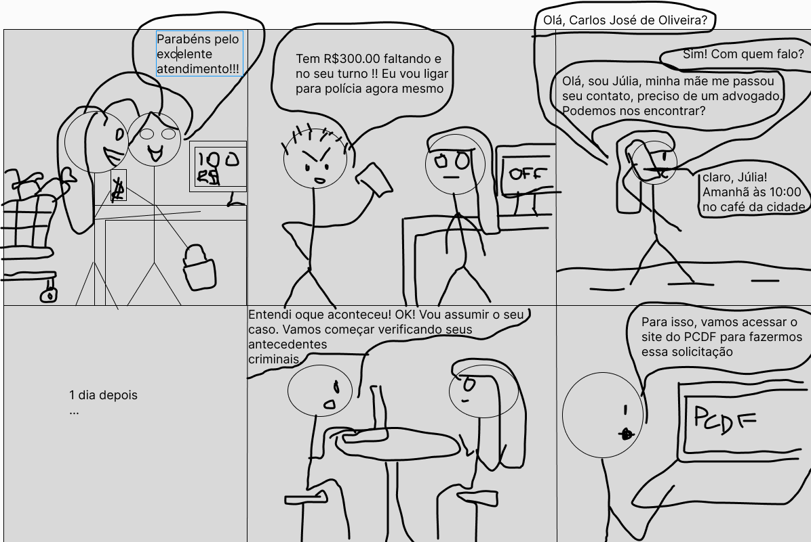
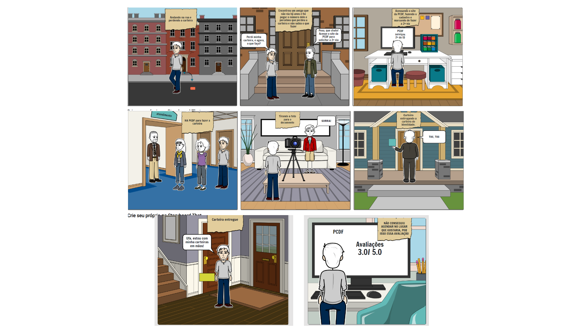

## Introdução
Um storyboard é uma representação visual sequencial de uma história ou processo, frequentemente usado na produção de filmes, animações, quadrinhos, jogos e, em avaliações de Interação Humano-Computador (IHC). Geralmente, consiste em uma série de quadros ou painéis que ilustram os principais eventos, ações ou etapas de uma narrativa ou processo.

Cada quadro de um storyboard geralmente inclui uma imagem ou ilustração acompanhada por texto descritivo que ajuda a explicar o que está acontecendo na cena, detalhando ações dos personagens, diálogos ou mudanças de cenário. Os storyboards são usados para planejar e visualizar uma sequência de eventos antes da produção final, permitindo que os criadores ajustem e refinem a narrativa, a composição visual e o fluxo de ações conforme necessário.

A Avaliação de Interação Humano-Computador (IHC) desempenha um papel fundamental no desenvolvimento de sistemas interativos, visando garantir a qualidade da interação entre usuários e interfaces digitais. Neste contexto, os storyboards surgem como uma ferramenta valiosa para representar visualmente os cenários de interação, facilitando a compreensão dos fluxos de atividades e a identificação de possíveis melhorias. Este documento apresenta os storyboards que retratam diferentes tarefas do site do PCDF.

## Objetivo
O objetivo deste documento é registrar os storyboards feitos por cada integrante do grupo 04.

## Metodologia
A metodologia adotada consiste na elaboração de storyboards feitos pelos integrantes do grupo, com base em cenários e personas previamente definidos. Cada integrante ficará responsável por desenvolver um storyboard que represente uma tarefa específica realizada por um usuário no contexto do sistema do PCDF. Cada storyboard deve conter os seguintes elementos:

* Pessoas envolvidas: São identificadas as personas ou usuários que estarão interagindo com o sistema, incluindo informações sobre suas características, necessidades e objetivos.

* Ambiente/contexto: O contexto em que a interação ocorre é descrito, fornecendo informações sobre o ambiente físico, social e cultural em que os usuários estão inseridos.

* Tarefas: São definidas as tarefas que os usuários precisam realizar no sistema, destacando as atividades específicas que serão abordadas no storyboard.

* Passos envolvidos: São apresentados os passos necessários para realizar cada tarefa, detalhando as ações dos usuários e as respostas do sistema.

* Motivação para usar o sistema: É explicada a motivação dos usuários para utilizar o sistema, destacando os benefícios que eles esperam obter ao completar as tarefas propostas.

* O que as pessoas precisam fazer para completar a tarefa: São descritas as ações e interações que os usuários devem realizar para concluir com sucesso cada tarefa.

* Satisfação da pessoa ao completar a tarefa: Ao final de cada storyboard, é avaliada a satisfação dos usuários ao completar a tarefa, considerando se suas expectativas foram atendidas e se obtiveram sucesso na realização das atividades propostas.

## Funcionalidades Tratadas no Stroryboard

    Tabela que monstra quais funcionalidades foram avaliadas pela HTA
 Funcionalidade    |    Integrante Responsável             |  
|:------:|:-------------------------------:|
|Pesquisar Procurados|Lara|  
| Solicitar Antecedentes Criminais | Renata |
| Validar Antecedentes Criminais | Joao |
| 197- Denúncia Online   | Giovana          |
| Solicitar Carteira de Identidade| Raissa
| Registrar Ocorrência | Rayene |
|Retrato Falado Online|Renata|

## Tarefa 1: Pesquisar procurados 

## Tarefa 2: Solicitar Antecedentes Criminais
As figuras 2, 3 e 4 são um storyboard feitos pela integrante [Renata Quadros](https://github.com/Renatinha28), no qual o usuário, Carlos José de Oliveira, precisa consultar os antecedentes de sua cliente Júlia Ribeiro, na qual foi processada injustamente. 

    
 Figura 2: Stroryboard de Solicitar antecedentes. Fonte: 
        <a href="https://github.com/Renatinha28">Renata</a>
    
 

    
 Figura 3: Stroryboard de Solicitar antecedentes . Fonte: 
        <a href="https://github.com/Renatinha28">Renata</a>
    
 

    
 Figura 4: Stroryboard de Solicitar antecedentes . Fonte: 
        <a href="https://github.com/Renatinha28">Renata</a>
    
 

## Tarefa 3: Validar certidão de antecedentes criminais 

## Tarefa 4: Denúncia Online

## Tarefa 5: Solicitar carteira de identidade 
Esse é um Storyboard de uma pessoa que perdeu a carteira de identidade e teve que solicitar o serviço para fazer uma nova.   

    
 Figura 5: Storyboard de Retrato Falado  . Fonte: 
        <a href="https://github.com/RaissaAndradeS">Raissa</a>
    
 

## Tarefa 6: Registrar Ocorrência 

## Tarefa 7: Fazer um retrato falado de forma online
As figuras 9, 10 e 11 representam o storyboard da funcionalidade sugerida. Foi feito pela integrante [Renata Quadros](https://github.com/Renatinha28) e se baseia na Ana Silva, uma médica que foi assaltada e está sem tempo de ir até a delegacia para registrar sua denúncia e seu retrato falado.

    
 Figura 9: Storyboard de Retrato Falado  . Fonte: 
        <a href="https://github.com/Renatinha28">Renata</a>
    
 

    
 Figura 10: Storyboard de Retrato Falado  . Fonte: 
        <a href="https://github.com/Renatinha28">Renata</a>
    
 

    
 Figura 11: Storyboard de Retrato Falado  . Fonte: 
        <a href="https://github.com/Renatinha28">Renata</a>
    
 

## Bibliografia
> BARBOSA, Simone; SILVA, Bruno. Interação Humano Computador. 1. ed. Rio de Janeiro: Elsevier, 2010.

## Histórico de Versões
      Tabela que descreve o Histórico de Versões

|     Versão       |     Descrição      |      Autor(es)      | Data           |  Revisor(es)          |Data de revisão|
| :----------------------------------------------------------: | :-------------------------------: | :-------------------------------------------------: | :-------------------------------: |  :-------------------------------: | :-------------------------------: |
| 1.0 | Criação do documento | [Renata Quadros](https://github.com/Renatinha28) | 16/05 |[Giovana Barbosa ](https://github.com/gio221) | 16/05  | 
| 1.1 | Storyboard da tarefa 2 | [Renata Quadros](https://github.com/Renatinha28) | 16/05 | [Giovana Barbosa ](https://github.com/gio221) | 16/05 | 
| 1.2 | Storyboard da tarefa 2 | [Raissa Andrade](https://github.com/RaissaAndradeS) | 16/05 | [Giovana Barbosa ](https://github.com/gio221) | 16/05 | 